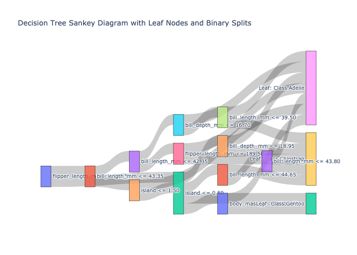

# DecisionTree-to-Sankey

[](https://badge.fury.io/py/decisiontree-to-sankey) [](https://github.com/LukeADay/DecisionTree-to-Sankey/issues) [](https://pepy.tech/project/decisiontree-to-sankey) 


`DecisionTree-to-Sankey` is a Python library (available on Available on PyPI: https://pypi.org/project/decisiontree-to-sankey/).

The library allows the user to visualize decision trees (from scikit-learn) as interactive `plotly` Sankey diagrams. Decision trees are known for their interpretability, but large trees can become hard to read when plotted traditionally. This library presents decision trees as Sankey diagrams, where nodes can be dragged to adjust fora overlapping labels, and conditions can be inspected interactively by hovering over the branches.

**Warning:** version 0.1 has been deprecated due to an import bug. This has been fixed with version 0.2.

## Compatibility Table


<!--COMPATIBILITY_TABLE_START-->
| Python Version | Compatibility | Last Tested        |
|----------------|---------------|--------------------|
| 3.7            | ✅ Supported       | November 2024     |
| 3.8            | ✅ Supported       | November 2024     |
| 3.9            | ✅ Supported       | November 2024     |
| 3.10            | ✅ Supported       | November 2024     |
| 3.11            | ✅ Supported       | November 2024     |
| 3.12            | ✅ Supported       | November 2024     |
<!--COMPATIBILITY_TABLE_END-->


## Dependencies

This package requires the following Python libraries:

<!--DEPENDENCIES_START-->
- `numpy>=1.21.0,<=2.1.3`
- `pandas>=1.3.0,<=2.2.3`
- `scikit-learn>=0.24.0,<=1.5.2`
- `plotly>=5.0.0,<=5.24.1`
<!--DEPENDENCIES_END-->


## Features

* Interactive Sankey Diagram: Visualize decision trees with adjustable nodes and hover-over conditions.
* Improved Readability: Handles overlapping labels by allowing users to drag nodes.
* Easy Integration: Use this tool with any decision tree created by `scikit-learn`.

## Installation

* **Option 1**: Installing via `pip`:

```
pip install decisiontree-to-sankey
```

* **Option 2**: Manual Installation
Clone the repository and install the environment via conda:

1. Clone the repository:

```
git clone https://github.com/LukeADay/DecisionTree-to-Sankey.git
```

2. Create the conda environment:
```
conda env create -f environment.yml
```

3. Activate the environment

```
conda activate tree-sankey-visualizer
```

4. Install the package

```
pip install .
```

## Usage

### Example Code
After installing the library, you can import and use it as follows:

```
from decisiontree_to_sankey import DecisionTree_to_Sankey
from sklearn.tree import DecisionTreeClassifier
import pandas as pd

# Sample data
data = pd.DataFrame({
    'Feature1': [1, 2, 3, 4],
    'Feature2': [5, 6, 7, 8]
})
target = [0, 1, 0, 1]

# Train a decision tree
clf = DecisionTreeClassifier()
clf.fit(data, target)

# Create and visualize the Sankey diagram
dt_sankey = DecisionTree_to_Sankey(clf, data)
dt_sankey.create_sankey()  # Displays the interactive Sankey diagram
```

**Warning** check the complexity of the tree before plotting. A tree that is too complex will not work - this requires judgement. See the complexity of the trained model:

```
try:
    n_leaves = regressor.get_n_leaves()
    depth = regressor.get_depth()
    print(f"Regressor is trained with {n_leaves} leaves and depth {depth}.")
except AttributeError:
    print("The regressor is not trained (empty).")
```

### Output Example

The following is an example of the Sankey diagram output. Nodes overlap initially, but the interactive version allows you to drag nodes around for better readability:



See `sankey_diagram.html` for an interactive version.

## Repository Structure

```
├── LICENSE
├── README.md
├── conda_requirements.txt
├── environment.yml
├── examples
│   ├── __init__.py
│   ├── penguine_dataset_example.ipynb
│   ├── penguine_dataset_example.py
│   ├── sankey_diagram.html
│   └── sankey_diagram.png
├── requirements.txt
├── setup.py
├── src
│   ├── DecisionTree_To_Sankey.py
│   ├── __init__.py
│   └── __pycache__
│       ├── DecisionTree_To_Sankey.cpython-310.pyc
│       └── __init__.cpython-310.pyc
└── tests
    ├── __pycache__
    │   └── test_decisiontree_to_sankey.cpython-310.pyc
    └── test_decisiontree_to_sankey.py
```

* The src/decisiontree_to_sankey module contains the core `DecisionTree_to_Sankey class`.
* Examples of how to use the library are available in the examples/ folder.
* Unit tests are provided in the `tests/` folder.

## License
This project is licensed under the MIT License - see the `LICENSE` file for details.
